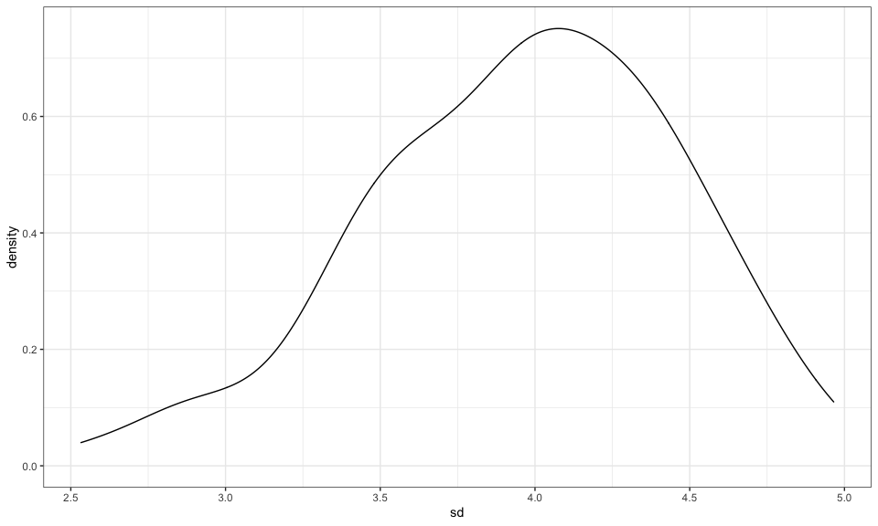

Simulations
================
E. Brennan Bollman
20-11-17

``` r
library(tidyverse)
```

    ## ── Attaching packages ──────────────────────────────────────────────── tidyverse 1.3.0 ──

    ## ✓ ggplot2 3.3.2     ✓ purrr   0.3.4
    ## ✓ tibble  3.0.3     ✓ dplyr   1.0.2
    ## ✓ tidyr   1.1.2     ✓ stringr 1.4.0
    ## ✓ readr   1.3.1     ✓ forcats 0.5.0

    ## ── Conflicts ─────────────────────────────────────────────────── tidyverse_conflicts() ──
    ## x dplyr::filter() masks stats::filter()
    ## x dplyr::lag()    masks stats::lag()

``` r
library(rvest)
```

    ## Loading required package: xml2

    ## 
    ## Attaching package: 'rvest'

    ## The following object is masked from 'package:purrr':
    ## 
    ##     pluck

    ## The following object is masked from 'package:readr':
    ## 
    ##     guess_encoding

``` r
knitr::opts_chunk$set(
  fig.width = 10,
  fig.asp = 0.6,
  out.width = "90%"
)

theme_set(theme_bw() + theme(legend.position = "bottom")) 

options(
  ggplot2.continuous.colour = "viridis",
  ggplot2.continuous.fill = "viridis"
)

scale_colour_discrete = scale_colour_viridis_d()
scale_fill_discrete = scale_fill_viridis_d()
```

## Sample simulation

Function

``` r
sim_mean_sd = function(samp_size, mu = 3, sigma = 4) {
  
  sim_data = 
    tibble(
    x = rnorm(n = samp_size, mean = mu, sd = sigma)
    )

  sim_data %>% 
    summarize(
      mean = mean(x),
      sd = sd(x)
    )
}
```

Simulate by running this line

``` r
sim_mean_sd(30)
```

    ## # A tibble: 1 x 2
    ##    mean    sd
    ##   <dbl> <dbl>
    ## 1  3.22  3.54

## Let’s simulate a lot

Start with a `for` loop.

``` r
output = vector("list", length = 100)

for (i in 1:100) {
  
  output[[i]] = sim_mean_sd(samp_size = 30)
  
}

bind_rows(output)
```

    ## # A tibble: 100 x 2
    ##     mean    sd
    ##    <dbl> <dbl>
    ##  1  3.87  3.61
    ##  2  2.43  4.24
    ##  3  2.97  4.25
    ##  4  3.63  4.24
    ##  5  3.41  4.16
    ##  6  3.49  4.25
    ##  7  2.53  5.01
    ##  8  4.44  3.46
    ##  9  3.04  3.71
    ## 10  2.75  3.56
    ## # … with 90 more rows

This Above doesn’t have input list, just has output list. Can use map to
apply input list to a function for output list

Let’s use a loop function.

``` r
sim_results = 
  rerun(100, sim_mean_sd(samp_size = 30)) %>% 
  bind_rows()
```

Can set the `set.seed` to make sure the random sample is same each time?

Let’s look at results

``` r
sim_results %>% 
  ggplot(aes(x = mean)) + geom_density()
```


``` r
sim_results %>% 
  summarize(
    avg_samp_mean = mean(mean),
    sd_samp_mean = sd(mean)
  )
```

    ## # A tibble: 1 x 2
    ##   avg_samp_mean sd_samp_mean
    ##           <dbl>        <dbl>
    ## 1          3.00        0.723

``` r
sim_results %>% 
  ggplot(aes(x = sd)) + geom_density()
```


