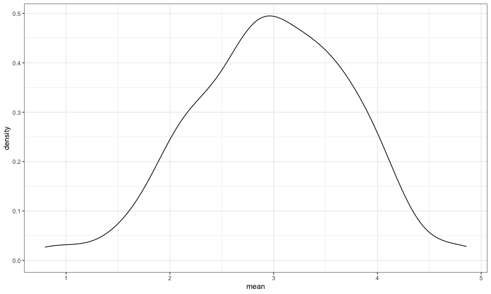

Simulations
================
E. Brennan Bollman
20-11-17

``` r
library(tidyverse)
```

    ## ── Attaching packages ──────────────────────────────────────────────── tidyverse 1.3.0 ──

    ## ✓ ggplot2 3.3.2     ✓ purrr   0.3.4
    ## ✓ tibble  3.0.3     ✓ dplyr   1.0.2
    ## ✓ tidyr   1.1.2     ✓ stringr 1.4.0
    ## ✓ readr   1.3.1     ✓ forcats 0.5.0

    ## ── Conflicts ─────────────────────────────────────────────────── tidyverse_conflicts() ──
    ## x dplyr::filter() masks stats::filter()
    ## x dplyr::lag()    masks stats::lag()

``` r
library(rvest)
```

    ## Loading required package: xml2

    ## 
    ## Attaching package: 'rvest'

    ## The following object is masked from 'package:purrr':
    ## 
    ##     pluck

    ## The following object is masked from 'package:readr':
    ## 
    ##     guess_encoding

``` r
knitr::opts_chunk$set(
  fig.width = 10,
  fig.asp = 0.6,
  out.width = "90%"
)

theme_set(theme_bw() + theme(legend.position = "bottom")) 

options(
  ggplot2.continuous.colour = "viridis",
  ggplot2.continuous.fill = "viridis"
)

scale_colour_discrete = scale_colour_viridis_d()
scale_fill_discrete = scale_fill_viridis_d()

set.seed(1)
```

## Sample simulation

Function

``` r
sim_mean_sd = function(samp_size, mu = 3, sigma = 4) {
  
  sim_data = 
    tibble(
    x = rnorm(n = samp_size, mean = mu, sd = sigma)
    )

  sim_data %>% 
    summarize(
      mean = mean(x),
      sd = sd(x)
    )
}
```

Simulate by running this line

``` r
sim_mean_sd(30)
```

    ## # A tibble: 1 x 2
    ##    mean    sd
    ##   <dbl> <dbl>
    ## 1  3.33  3.70

## Let’s simulate a lot

Start with a `for` loop.

``` r
output = vector("list", length = 100)

for (i in 1:100) {
  
  output[[i]] = sim_mean_sd(samp_size = 30)
  
}

bind_rows(output)
```

    ## # A tibble: 100 x 2
    ##     mean    sd
    ##    <dbl> <dbl>
    ##  1  3.53  3.18
    ##  2  3.44  3.84
    ##  3  3.45  3.53
    ##  4  1.68  3.69
    ##  5  3.95  4.22
    ##  6  3.27  4.34
    ##  7  2.05  4.05
    ##  8  3.10  3.72
    ##  9  3.55  4.11
    ## 10  3.87  3.79
    ## # … with 90 more rows

This Above doesn’t have input list, just has output list. Can use map to
apply input list to a function for output list

Let’s use a loop function.

``` r
sim_results = 
  rerun(100, sim_mean_sd(samp_size = 30)) %>% 
  bind_rows()
```

Can set the `set.seed` to make sure the random sample is same each time?

Let’s look at results

``` r
sim_results %>% 
  ggplot(aes(x = mean)) + geom_density()
```



``` r
sim_results %>% 
  summarize(
    avg_samp_mean = mean(mean),
    sd_samp_mean = sd(mean)
  )
```

    ## # A tibble: 1 x 2
    ##   avg_samp_mean sd_samp_mean
    ##           <dbl>        <dbl>
    ## 1          2.98        0.756

``` r
sim_results %>% 
  ggplot(aes(x = sd)) + geom_density()
```


## Let’s try other sample sizes

Many things in statistics are dependent on sample size. Start with `for`
loop to make easier.

Want to run sim code 100x for each of below n’s and save results each
time. Output object should match size input object so can make into
tibble.

``` r
n_list = 
  list(
    "n = 30" = 30,
    "n = 60" = 60,
    "n = 120" = 120,
    "n = 240" = 240
  )

output = vector("list", length = 4)

for (i in 1:4) {
  
  output[[i]] = rerun(100, sim_mean_sd(samp_size = n_list[[i]])) %>% 
    bind_rows()

}
```

Put this in a simpler process

``` r
sim_results_1 = 
  tibble(
  samp_size = c(30, 60, 120, 240)
  ) %>% 
  mutate(
    output_lists = map(.x = samp_size, ~ rerun(1000, sim_mean_sd(.x))),
    estimate_df = map(output_lists, bind_rows)
  ) %>% 
  select(-output_lists) %>% 
  unnest(estimate_df)
```

Do some dataframe things

``` r
sim_results_1 %>% 
  mutate(
    sample_size = str_c("n = ", samp_size),
    sample_size = fct_inorder(sample_size)
  ) %>% 
  ggplot(aes(x = sample_size, y = mean)) + 
  geom_violin()
```


``` r
sim_results_1 %>% 
  group_by(samp_size) %>% 
  summarize(
    avg_samp_mean = mean(mean),
    sd_samp_mean = sd(mean)
  )
```

    ## `summarise()` ungrouping output (override with `.groups` argument)

    ## # A tibble: 4 x 3
    ##   samp_size avg_samp_mean sd_samp_mean
    ##       <dbl>         <dbl>        <dbl>
    ## 1        30          2.99        0.720
    ## 2        60          3.02        0.514
    ## 3       120          2.99        0.374
    ## 4       240          3.00        0.263

Can do `cache` in {r} to set the results of sim when knit. Or can do
`set.seed(1)` to get same random numbers.
